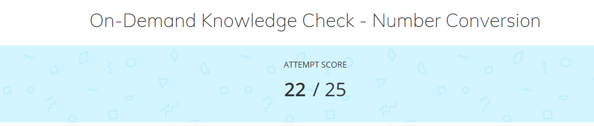

# Artifact Name

 Image| August 2026 

## Summary

This artifact is how we showed are understanding of converting numbers. for the On-Demand Knowledge Check for we hade to complete 25 conversion problems to show are knowledge.

**Project:** On-Demand Knowledge Check

**My role:** my role was to listen and taking in new information and practicing them to be able to convert numbers.

## The Artifact

This is a image of the score that i got on the On-Demand Knowledge Check

[View the full artifact](LINK-TO-ARTIFACT)

## Skills Demonstrated

 Number conversions

## Implementation
I listened to the the instructions and learn how to convert numbers. Then I took what i learned and completed the knowledge check.

## What I Learned

I learned how to convert numbers for different basses and learned how they work to tell the computer different things.

---

[Return to All Artifacts]({{ '/artifacts.html' | relative_url }})